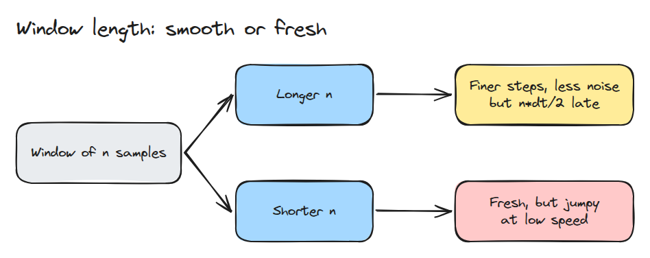
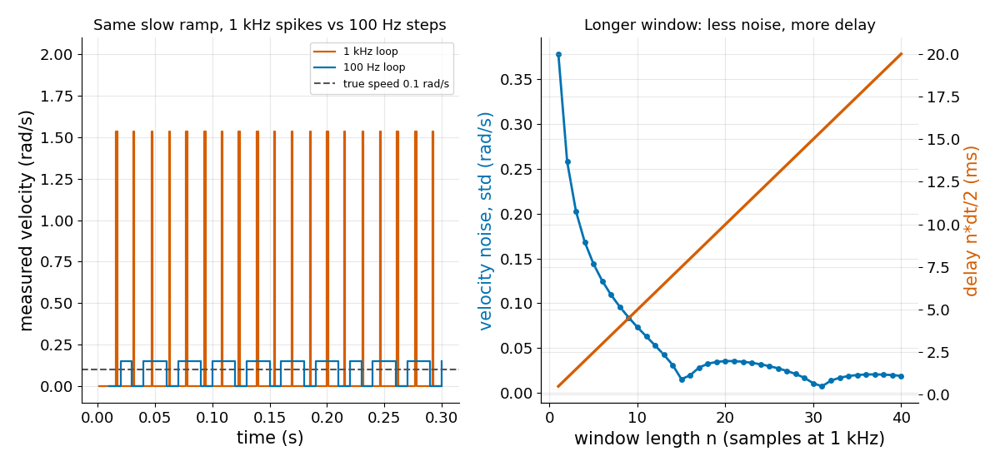

# Encoder와 양자화 (Encoders and Quantisation)

> 느리게 도는 관절의 속도 값이 왜 들쭉날쭉한지, 그리고 그것을 부드럽게 하면 왜 늦어지는지 배웁니다.

**유형:** 만들기   **선수 지식:** 없음   **시간:** 약 15분

## 쉽게 말하면

홈이 뚫린 원판이 고정된 센서 앞을 천천히 지나가요. 센서는 홈 모서리가 하나 더 지나갔다는 것만 알려 주고 그것이 count 하나예요. 속도는 센 count 수를 센 시간으로 나눈 값이에요.

자주 확인하면 대부분 아무것도 안 보이다가 갑자기 모서리 하나가 보여서 속도가 튀어요. 오래 기다리면 안정되지만 각 값이 더 오래된 순간을 말해요.

## 핵심 용어

- **Encoder**: 축이 얼마나 돌았는지 정수 단계로 알려 주는 센서입니다.
- **Count**: encoder가 알려 주는 한 단계입니다. 여기서는 홈 모서리 하나가 센서를 지나간 것입니다.
- **CPR**: 한 바퀴당 count 수입니다. 한 바퀴가 몇 단계인지 알려 줍니다.
- **Quantisation**: 부드러운 값을 정수 단계로 반올림하는 일입니다. 작은 변화는 보이지 않게 됩니다.
- **Window**: 속도를 구하려고 빼는 두 count가 몇 번 읽기만큼 떨어져 있는지입니다.
- **Damping term**: 속도가 클수록 세지는 브레이크라서 빠른 관절을 더 세게 제동합니다.

## 문제

관절이 느리고 매끄럽게 도는데도 속도 값이 0과 큰 값 사이를 뛰고 damping 항이 그때마다 관절을 걷어찹니다. 필터를 넣으면 걷어차는 일은 멈춥니다. 하지만 속도 값이 늦게 도착해서 관절이 진동합니다.

## 개념

관절의 속도는 보통 encoder count에서 구하므로 느리게 움직이는 로봇은 모두 이 문제를 만납니다.


*부드러운 축, 계단 카운트, 뾰족한 속도입니다.*

encoder는 정수 count만 알려 주므로 각도는 작은 계단으로 올라갑니다. 이전 count를 빼서 속도를 구하면 계단 하나하나가 spike가 됩니다. 저속에서는 대부분의 값이 변화 없음을 보이고 몇 개만 크게 튑니다.



*창이 길수록 노이즈가 적고 답은 더 오래됩니다.*

count를 더 멀리 떨어뜨려 견주면 속도가 부드러워집니다. 이것이 더 긴 창입니다. 노이즈는 줄지만 답이 더 오래된 순간을 말해서 속도가 늦게 도착합니다.


*파란 바늘(count를 한 번 읽기 간격으로 비교)은 참 속도에 붙어 있고 초록 바늘(여러 번 읽기 간격)은 뒤처져 따라옵니다.*



*왼쪽은 자주 확인하면 드문 높은 spike, 덜 자주 확인하면 작은 계단입니다. 오른쪽은 창이 길수록 노이즈가 줄고 지연이 느는 모습입니다.*

<details><summary>The math (optional)</summary>

카운트 하나는 `2*pi / CPR` rad입니다. 이것을 샘플 시간 `dt`로 나누면 한 샘플이 보고할 수 있는 가장 작은 속도 `2*pi / (CPR * dt)`가 됩니다. `CPR = 4096`, `dt = 1 ms`이면 1.53 rad/s입니다.
0.1 rad/s로 도는 관절은 약 15 ms마다 카운트 하나를 만들어서 15번 중 14번은 0으로 읽히고 나머지는 1.53으로 읽힙니다. `n` 샘플 창은 step을 `n`으로 나누고 변하는 신호를 `n*dt/2`만큼 늦춥니다.
속도가 2 rad/s^2로 오르고 `n = 20`, `dt = 1 ms`이면 추정값은 10 ms 전의 값이라 `2 * 0.01 = 0.02` rad/s만큼 낮게 읽힙니다. 그림에서 1 kHz는 초당 1000번 읽는다는 뜻이고 100 Hz는 100번입니다.

</details>

## 만들기

```python
def min_velocity_step(cpr, dt):
    return TWO_PI / cpr / dt

def window_velocity(c, cpr, dt, n):
    return (c[n:] - c[:-n]) * TWO_PI / cpr / (n * dt)

def window_lag(n, dt):
    return n * dt / 2
```

```bash
cd robotics-engineering-from-scratch
python3 -m pytest phases/04-actuators-and-sensors/03-encoders-and-quantisation -q
python3 phases/04-actuators-and-sensors/03-encoders-and-quantisation/code/figure.py
```

## 실제 도구로 보기

drive는 창 안의 edge를 세거나 edge 사이 간격을 재서 속도를 추정합니다.

출처 (2026년 11월 9일 접속):

- [maxon, encoder selection part three](https://www.maxongroup.com/en-us/knowledge-and-support/blog/encoder-selection-part-three-speed-control-25728)

## 결과물

`outputs/skill-encoder-velocity-check.md`는 속도 step을 계산하고 관절에 맞는 창 길이를 고릅니다.

## 연습 문제

1. 카운트 사이 간격을 대신 재서 저속에서 노이즈를 비교하세요.
2. 한 번 읽기 차분만으로 속도가 안정되는 속도를 찾으세요.
3. ramp 속도를 바꾸고 "노이즈와 지연" 오른쪽 그림의 꺼짐이 움직이는 것을 보세요.
