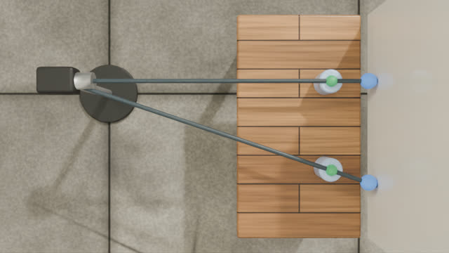
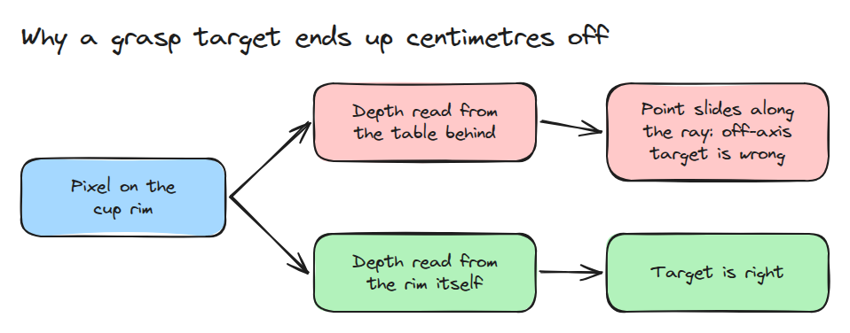
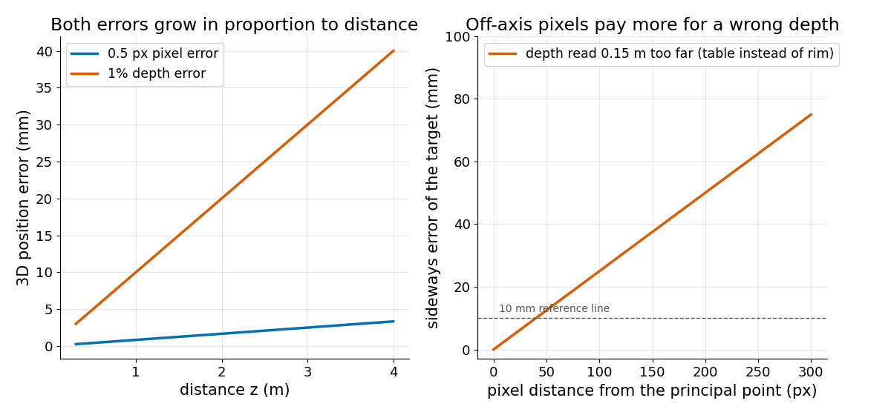

# Pinhole Camera

> Learn why a camera gives the direction of a cup but not its distance, and what that costs.

**Type:** Build   **Prerequisites:** none   **Time:** ~15 minutes

## In Plain Words

A camera sees a cup in front of a wall. The cup's rim and a spot on the wall lie on one line of sight, so they share a pixel. A pixel gives a direction, not a distance. If the code takes the wall's depth for that pixel, the arm reaches past the cup.

## Key Terms

- **Pixel**: one dot of a camera image.
- **Depth (`z`)**: how far a point is in front of the camera.
- **Ray**: the line of sight through a pixel. Every point on it lands on that pixel.
- **Focal length (`fx, fy`)**: how strongly the lens zooms in, across and up.
- **Principal point (`cx, cy`)**: the pixel where the camera's centre line lands.
- **Projection**: turning a 3D point into a pixel.

## The Problem

A camera sees a cup, yet the gripper closes a few centimetres to the side. The depth came from the wall behind the rim.

## The Concept

To grab what it sees, a robot must turn each pixel into a 3D point, and that needs a distance.


*Projection turns a 3D point into a pixel and loses the depth.*

A pixel is only a line of sight. Every point along that line lands on the same pixel, so the distance decides which point you mean. Use the wall's distance for a pixel on the cup's rim and the point slides along the line.

[](../assets/clip-example.mp4)

*Same distance mistake for both cups. The edge cup's ball also slides sideways.*



*Look at which point the pixel lands on, depending on where the depth is read.*



*Left: errors grow with distance. Right: sideways error grows toward the edge.*

<details><summary>The math (optional)</summary>

The camera frame has `x` right, `y` down and `z` forward, so `u = fx*x/z + cx` and `v = fy*y/z + cy` (`fx, fy` are measured in pixels). A pixel error `du` moves the point sideways by `z*du/fx`. The line leans away from the image centre, so a depth error `dz` slides the point along the ray and also sideways, by `dz*(u-cx)/fx`: zero at the centre, more at the edges. Take pixel `(520, 240)`, `fx = 600`, `cx = 320`. At the rim's depth, 1.00 m, the point is 0.33 m right of the centre line. At the wall's depth, 1.15 m, it is 0.38 m: 5 cm off. The figure uses 0.5 px and 1% depth errors, and a 0.15 m depth mistake.

</details>

## Build It

```python
def project(P, fx, fy, cx, cy):
    return np.stack([fx*P[:,0]/P[:,2] + cx, fy*P[:,1]/P[:,2] + cy], axis=1)

def unproject(uv, z, fx, fy, cx, cy):
    return np.stack([(uv[:,0]-cx)*z/fx, (uv[:,1]-cy)*z/fy, z], axis=1)
```

`position_error()` turns a pixel back into a 3D point with and without a pixel shift (`du`) and a depth error (`dz`).

```bash
cd robotics-engineering-from-scratch
python3 -m pytest phases/06-perception-and-calibration/01-pinhole-camera -q
```

## Use It

Compare `project` with `cv2.projectPoints` from OpenCV, a computer-vision library.

Sources: the [OpenCV calibration tutorial](https://opencv24-python-tutorials.readthedocs.io/en/latest/py_tutorials/py_calib3d/py_calibration/py_calibration.html) (an older version) uses `cv2.projectPoints` for reprojection error.

## Ship It

`outputs/skill-pixel-depth-check.md` checks that a pixel and its depth belong to the same surface.

## Exercises

1. Add a term for lens warping (distortion).
2. Sample depth at the median of a 5x5 window and find where it still fails.
3. Estimate the sideways error at 2 m for the pixel and depth mistake in the math fold.
