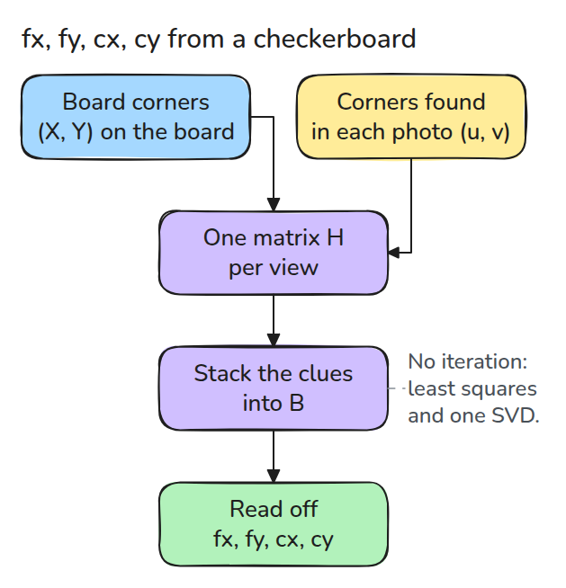
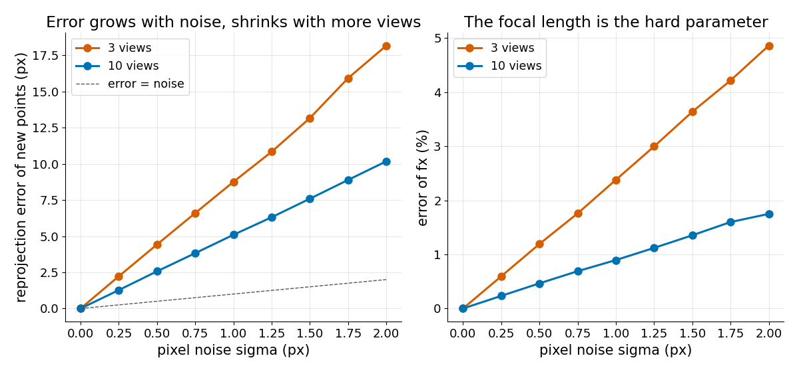

# 카메라 캘리브레이션 (Camera Calibration)

> 체커보드와 기울여 찍은 몇 장의 사진으로 카메라 자신의 줌과 중심을 재는 법을 배웁니다.

**유형:** 만들기   **선수 지식:** 06/01 핀홀 카메라   **시간:** 약 15분

## 쉽게 말하면

카메라가 체커보드를 봐요. 칸은 모두 크기가 같고 모서리가 직각이라서 사진 속 찌그러진 칸은 보드의 기울기와 렌즈에서 와요.

기울기를 바꿀 때마다 새 단서가 돼요. 보드를 기울이지 않고 밀기만 하면 새 단서가 없어요.

## 핵심 용어

- **Calibration**: 줌이나 중심 같은 카메라 자신의 값을 아는 표적으로 재는 일입니다.
- **Intrinsics (`K`)**: `fx, fy, cx, cy`를 담은 matrix(숫자 격자)입니다.
- **Homography (`H`)**: 평평한 보드 위의 점을 pixel로 보내는 3x3 matrix입니다.
- **Degenerate views**: 같은 단서를 되풀이해서 풀 수 없는 시점들입니다.
- **SVD**: matrix 분해 도구입니다. 가장 작은 특이 벡터가 "이 곱을 0에 최대한 가깝게"라는 문제를 풉니다.
- **Reprojection error**: 내 값으로 투영한 모서리가 실제로 본 모서리와 얼마나 떨어져 있는지입니다.

## 문제

로봇이 카메라로 본 것을 집으려는데 이미지 가장자리 근처에서 몇 센티미터 빗나갑니다. datasheet의 focal length는 내 카메라의 값이 아니므로 아는 표적으로 `fx`와 `cx`를 직접 재야 합니다.

## 개념

카메라는 저마다 조금씩 달라서 datasheet를 믿는 로봇은 물건의 위치를 잘못 판단합니다.



*시점마다 `H`가 나오고 `H`들에서 `B`가 나오고 `B`에서 `fx, fy, cx, cy`가 나옵니다.*

보드의 모서리는 `Z = 0`인 `(X, Y)`입니다. 시점마다 `(X, Y, 1)`을 pixel로 보내는 3x3 `H = K [r1 r2 t]`가 나옵니다(`r1, r2`는 보드의 변 방향이고 `t`는 위치). 그래서 `h1 = K r1`이고 `h2 = K r2`입니다.

변은 서로 수직이고 길이가 같으므로 `h1' B h2 = 0`과 `h1' B h1 = h2' B h2`가 성립합니다(`'`는 transpose). 미지수는 `B = K^-T K^-1`에 담겨 있고 시점마다 식이 두 개 나옵니다.
`B`는 대칭이라 숫자가 여섯 개이고 zero skew(pixel 격자의 기울어짐)가 하나를 없애며 scale은 모르므로 식 네 개면 충분합니다. 기울인 시점 두 장이면 됩니다.

`fx = 620`, `fy = 580`, `cx = 330`, `cy = 235`일 때 `make_views(K, 4, 0.0, 3)`은 시점 4개를 만듭니다(노이즈 없음, seed 3). 28도에서 42도로 기울이면 정확히 그 `K`가 돌아옵니다.
밀기만 하면 같은 단서가 되풀이되어 `calibrate()`가 `degenerate views`를 일으킵니다.


*파란 보드는 밀기만 합니다. 빨간 십자(거부)입니다. 초록 보드는 매번 기울입니다. 초록 공(풀림)입니다.*


*미는 것은 같은 단서를 되풀이하고 기울이면 새 단서가 더해집니다.*



*100번 실행의 median입니다. 시점 3장은 pixel 노이즈의 몇 배 오차를 주고 시점을 늘리면 절반으로 줄어듭니다.*

## 만들기

```python
A = np.array([r for H in Hs for r in (_v(H, 0, 1), _v(H, 0, 0) - _v(H, 1, 1))])
b = np.linalg.svd(A)[2][-1]          # smallest singular vector = [B11, B22, B13, B23, B33]
cx, cy = -B13 / B11, -B23 / B22
fx, fy = np.sqrt(lam / B11), np.sqrt(lam / B22)   # lam = B33 - B13^2/B11 - B23^2/B22
```

`homography_dlt()`는 점을 정규화하고 가장 작은 특이 벡터를 취합니다. `calibrate()`는 퇴화했거나 물리적으로 말이 안 되는 결과면 오류를 일으킵니다.

```bash
cd robotics-engineering-from-scratch
python3 -m pytest phases/06-perception-and-calibration/02-camera-calibration -q
```

## 실제 도구로 보기

같은 시점들에서 `cv2.calibrateCamera`와 비교해 보세요.

출처: [OpenCV calibration tutorial](https://opencv24-python-tutorials.readthedocs.io/en/latest/py_tutorials/py_calib3d/py_calibration/py_calibration.html)(옛 버전)은 `cv2.calibrateCamera`와 reprojection 오차를 설명합니다.

## 결과물

`outputs/skill-intrinsics-calibration-check.md`는 시점의 다양성, 오차 크기, 그럴듯함을 점검합니다.

## 연습 문제

1. zero skew 가정을 버리고 `B12`를 더하세요.
2. 1 px 노이즈에서 실패하지 않는 가장 적은 시점 수를 찾으세요.
3. `scipy.optimize.least_squares`로 정제 단계를 더하세요.
