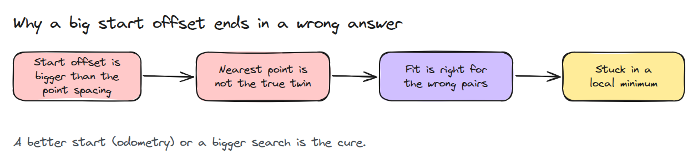
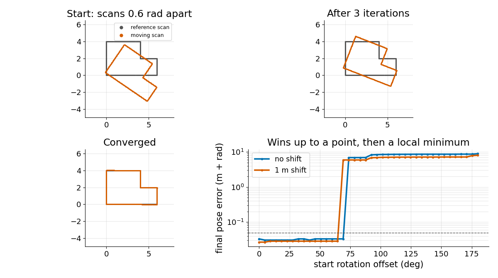

# ICP 스캔 정합 (Scan Matching with ICP)

> 로봇이 같은 방을 찍은 레이저 스캔 두 장을 겹쳐서 얼마나 움직였는지 알아내는 방법을 알아봅니다.

**유형:** 만들기   **선수 지식:** 01/01 회전과 SE(3), 08/01 차동 구동과 Odometry   **시간:** 약 15분

## 쉽게 말하면

로버가 L자 방을 스캔해서 벽을 따라 점을 얻어요. 조금 움직인 뒤 다시 스캔하면 새 점들이 옛 점들과 어긋나요.
ICP는 새 점마다 가장 가까운 옛 점을 짝짓고 새 점 전체를 밀고 돌려 짝 사이를 가깝게 한 뒤 이것을 반복해요.

멀리서 시작하면 가까운 점이 엉뚱한 벽끼리 짝이 되어서 점 사이 거리는 줄어도 추정한 이동은 틀려요.

## 핵심 용어

- **ICP**: iterative closest point입니다. 가까운 점끼리 짝짓고 이동을 맞추는 일을 반복합니다.
- **Rigid move**: 모양 안의 거리를 바꾸지 않는, 돌리기와 밀기입니다.
- **Nearest neighbour**: 다른 스캔에서 가장 가까운 점입니다.
- **SVD**: 표준 행렬 도구입니다. 여기서는 짝들에 가장 알맞은 회전을 찾습니다.
- **Local minimum**: 작은 움직임으로는 오차가 더 줄지 않는 막다른 곳입니다. 답이 틀려도 그렇습니다.

## 문제

로봇이 방을 스캔하고 조금 움직인 뒤 다시 스캔한다고 상상해 보세요. 바퀴 odometry(08/01)는 drift하므로 이름표 없는 점 구름일 뿐인 두 스캔만으로 실제 이동을 알고 싶습니다.

## 개념

실제 로봇은 이것으로 바퀴가 준 추측을 스캐너가 실제로 본 것으로 바로잡습니다.


*점을 짝짓고 강체 이동 하나를 맞춰 적용합니다.*

짝이 맞다면 한 번에 가장 좋은 회전 `R`과 이동 `t`가 나옵니다. 두 점 집합의 중심을 각자의 평균에 맞춥니다. 짝지은 점들이 어떻게 겹치는지를 SVD로 분해하면 `R`이 나오고 거울상은 부호를 바로잡아 막습니다. 이동은 `t = q_mean - R p_mean`입니다.

점은 0.05 m 간격입니다. 0.2 rad 어긋나게 시작하면 새 점에서 가장 가까운 옛 점까지의 평균 거리가 0.39 m이고 12번 반복하면 0.016 m가 됩니다.
2.6 rad 어긋나게 시작하면 4.07 m이고 짝이 대부분 틀려서 25번 반복해도 0.54 m에서 멈추며 스캔은 여전히 2.5 rad 틀어져 있습니다.


*초록(0.2 rad)은 맞습니다. 파랑(2.6 rad)은 엉뚱한 벽과 짝이 되어 갇힙니다.*



*시작 어긋남이 크면 가장 가까운 점이 엉뚱한 벽에 있습니다.*

오차는 오르지 않습니다. 각 맞춤은 그 짝에서 최적이고 다시 짝지으면 거리가 줄기만 하기 때문입니다.



*오른쪽은 시작 회전에 따른 최종 오차입니다. 이 방에서는 약 65~70도까지 좋고 그 뒤에는 local minimum입니다.*

## 만들기

```python
def kabsch(P, Q):
    pc, qc = P.mean(0), Q.mean(0)
    U, _, Vt = np.linalg.svd((P - pc).T @ (Q - qc))
    D = np.diag([1.0, np.sign(np.linalg.det(Vt.T @ U.T))])
    R = Vt.T @ D @ U.T
    return R, qc - R @ pc

match = dst[nearest(cur, dst)]
dR, dt = kabsch(cur, match)
cur = cur @ dR.T + dt
```

`icp()`는 이것을 반복하고 전체 `R`, `t`와 오차 기록을 돌려줍니다.

```bash
cd robotics-engineering-from-scratch
python3 -m pytest phases/08-mobile-robots/05-icp-scan-matching -q
python3 phases/08-mobile-robots/05-icp-scan-matching/code/main.py
```

## 실제 도구로 보기

Open3D의 ICP registration은 대략적인 초기 변환을 받고 대응 찾기와 변환 갱신을 번갈아 합니다. `icp()`와 비교하고 odometry를 초기 추정으로 넣어 보세요.

출처는 Open3D의 ICP registration tutorial입니다(https://www.open3d.org/docs/latest/tutorial/pipelines/icp_registration.html, 2026년 11월 10일 확인).

## 결과물

`outputs/skill-icp-check.md`는 스캔 정합 단계의 나쁜 시작, 평평한 벽, 근거 없는 확신을 점검합니다.

## 연습 문제

1. 두 스캔에 2 cm 노이즈를 넣고 자세 오차를 점 간격과 비교하세요.
2. odometry 추정에서 ICP를 시작해 고칠 수 있는 가장 큰 회전 drift를 찾으세요.
3. 가장 나쁜 짝 20%를 무시하고 모서리가 빠진 경우로 테스트하세요.
