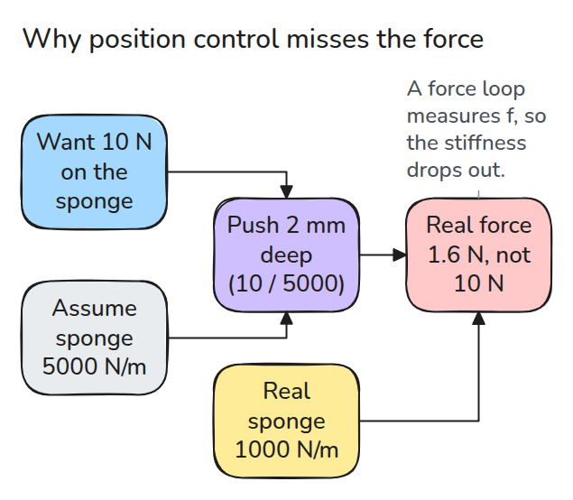
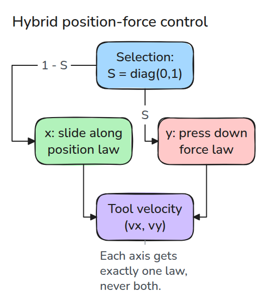

# 힘 제어와 하이브리드 제어 (Force and Hybrid Control)

> 로봇이 얼마나 무른지 모르는 표면을 알맞은 힘으로 누르는 방법을 알아봅니다.

**유형:** 만들기   **선수 지식:** 11/01 접촉 모델   **시간:** 약 15분

## 쉽게 말하면

스펀지로 책상을 닦을 때는 옆으로 움직이면서 아래로 눌러요. 같은 깊이까지 눌러도 스펀지가 더 무르면 힘이 달라져요.

force control은 누르는 힘을 재고 약하면 더 들어가고 강하면 물러나요. hybrid control은 미끄러지는 방향에는 위치 목표를 주고 누르는 방향에는 힘 목표를 줘요. 그래서 도구가 굴곡을 따라가면서도 누르는 힘을 유지해요.

## 핵심 용어

- **Force control**: 계획한 위치가 아니라 잰 힘에 따라 도구를 움직이는 제어입니다.
- **Hybrid control**: 어떤 축은 위치 제어로, 나머지 축은 힘 제어로 다루는 방식입니다.
- **Stiffness (`ke`)**: 표면을 1 m 눌렀을 때 되미는 힘(N)입니다.
- **Gain (`ki`)**: 힘 오차를 도구 속도로 바꾸는 배율입니다.
- **Time constant**: 오차가 약 3분의 2만큼 줄어드는 데 걸리는 시간입니다.
- **Selection matrix (`S`)**: 축마다 힘 법칙과 위치 법칙 중 하나를 고르는 스위치입니다.

## 문제

로봇이 스펀지를 일정한 힘으로 눌러야 한다고 상상해 보세요. 스펀지가 얼마나 무른지 짐작하고 정해 둔 깊이까지 누릅니다. 스펀지가 짐작보다 뻣뻣하면 훨씬 세게 누르게 됩니다.


*같은 깊이로 스펀지 세 개를 누르면 힘이 크게 다릅니다.*

## 개념

닦거나 갈아 내는 로봇은 일정한 위치가 아니라 일정한 힘이 필요합니다.

force control은 짐작을 건너뜁니다. 로봇이 누르는 힘을 직접 재서 약하면 더 들어가고 강하면 물러납니다.



*명령은 짐작한 강성에서만 맞습니다.*


*force control은 모든 표면에서 목표에 도달합니다.*

실제 작업은 둘 다 필요합니다. 표면을 따라서는 위치로 미끄러지고 표면 쪽으로는 힘으로 누릅니다. 이것이 hybrid control입니다.



*x 방향은 위치, y 방향은 힘입니다.*


*경로가 범프를 따르고 힘은 일정하게 유지됩니다.*

<details><summary>The math (optional)</summary>

로봇이 10 N으로 누르려고 5000 N/m로 가정하고 2 mm만큼 누르라고 명령하지만 스펀지 윗면이 0.4 mm 낮아서 1.6 mm만 눌립니다.
그러면 1000 N/m는 1.6 N, 5000 N/m는 8 N, 25000 N/m는 40 N이 됩니다.
힘 루프는 공구 끝을 속도 `v = ki * (fd - f)`로 움직입니다.
`fd`는 원하는 힘이고 `f`는 잰 힘입니다.
spring 표면 `f = ke * x`에서 차이는 overshoot 없이 `1 / (ke * ki)`초마다 약 3분의 2씩 줄어들므로 더 뻣뻣한 표면에서 더 빨리 안정됩니다.
`dt`마다 차이에 `1 - ke * ki * dt`가 곱해지므로 `ke * ki * dt < 2`일 때만 안정하고 무른 패드에서 잘 되던 루프가 강철에서는 흔들릴 수 있습니다.
선택 행렬 `S`는 각 축에 법칙을 하나씩 주고 `S = diag(0, 1)`은 x는 위치, y는 힘이라는 뜻입니다.

</details>

## 만들기

하이브리드 법칙은 두 법칙의 속도를 섞습니다.

```python
v = (1 - S) * v_pos + S * v_frc
p = p + np.clip(v, -lim, lim) * dt
```

가정은 정확한 속도 추종, 마찰 없는 선형 spring, 잡음 없는 힘 측정입니다.

```bash
cd robotics-engineering-from-scratch
python3 -m pytest phases/11-contact-and-manipulation/02-force-and-hybrid-control -q
python3 phases/11-contact-and-manipulation/02-force-and-hybrid-control/code/main.py
```

## 실제 도구로 보기

MuJoCo에서 같은 누르기를 돌리고 정착한 힘을 강성 곱하기 깊이와 비교하세요.

출처: Craig(11장)와 원 논문은 출판사 페이지가 403을 돌려주어 열어 보지 못했으므로 둘 다 대조하지 않았습니다.

## 결과물

`outputs/skill-force-control-check.md`는 접촉 작업에서 강성에 민감한 명령과 높은 gain을 점검합니다.

## 연습 문제

1. 로봇에 실제 강성을 알려 주면 위치 제어도 되지만 그 표면에서만 그렇다는 것을 보세요.
2. 루프 gain을 힘이 흔들리기 시작할 때까지 올려 보세요.
3. 힘 측정에 작은 지연을 더하고 안전한 gain이 줄어드는 것을 보세요.
