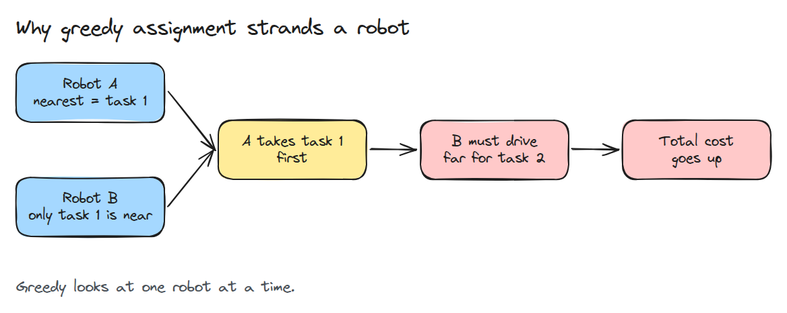
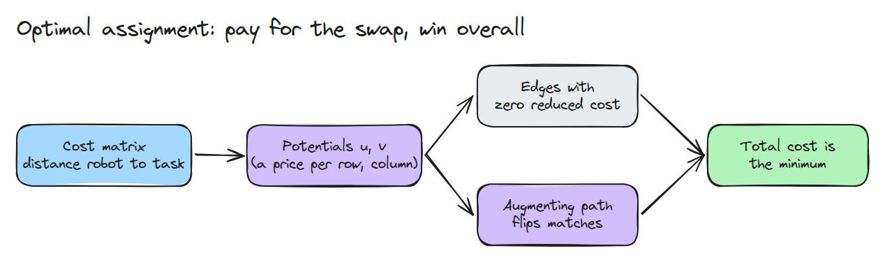

# Task Allocation

> Learn how to hand out jobs to a team of robots so the total travel is smallest.

**Type:** Build   **Prerequisites:** 08/01 Differential Drive and Odometry   **Time:** ~15 minutes

## In Plain Words

Five toy cars each need a different pad. If every car takes the nearest free pad in turn, the last car may be left with a pad across the floor.

Task allocation compares every car-to-pad distance. The Hungarian method may revise earlier matches to find the smallest total.

## Key Terms

- **Task allocation**: deciding which robot does which job.
- **Greedy**: picking what looks best right now without looking ahead.
- **Assignment**: a one-to-one pairing of robots and jobs.
- **Cost matrix `C`**: a table of how far each robot is from each job.
- **Hungarian method**: a step-by-step method that finds the cheapest overall assignment.
- **Augmenting path**: a chain of swaps that rearranges the pairs to fit one more.

## The Problem

A warehouse has ten robots and ten pick-up points. If each robot grabs the closest free point in turn, the last one may cross the whole floor.

## The Concept

Handing out jobs one by one wastes battery and time, so robots must plan as a group. A greedy robot takes the closest free job, which can force a later robot into a long trip. The Hungarian method looks at all the distances together and may undo an early pairing to make the total smallest.



*An early cheap pick forces a later costly one: car 4 takes the only pad near car 5.*



*The Hungarian method swaps pairings along chains until the total cannot get smaller.*


*Greedy crosses the map. The best assignment keeps pairs close.*


*The more robots there are, the more greedy costs compared with the best.*


*Blue (greedy): car 5 crosses the floor. Green (Hungarian): cars 3, 4 and 5 trade pads.*

<details><summary>The math (optional)</summary>

`C[i, j]` is the distance from robot `i` to job `j`; we want the smallest total. In the clip, cars 1 and 2 take the same pads either way (1.29 m). Cars 3 to 5 decide the rest (metres):

| car \ pad | 1 | 3 | 5 |
|---|---|---|---|
| 3 | 0.65 | 0.69 | 1.53 |
| 4 | 0.52 | 1.43 | 1.14 |
| 5 | 2.36 | 2.22 | 0.77 |

Greedy: 0.65 + 1.14 + 2.22 = 4.01 m. Best: 0.69 + 0.52 + 0.77 = 1.98 m. With cars 1 and 2: 5.3 m against 3.3 m. Greedy costs about 1.12 times the best at N = 4 robots and 1.28 times at N = 32 (300 layouts each). For 6 robots and 4 jobs, pad the table with zero-cost dummy jobs. Brute force would try 30! orders for 30 robots.

</details>

## Build It

`greedy()` takes the cheapest free job for each robot. `hungarian()` keeps prices on rows and columns until each robot is matched.

```python
cur = C[i0 - 1, j - 1] - u[i0] - v[j]   # reduced cost of edge (robot i0, task j)
```

Tests compare it with brute force and with SciPy.

```bash
cd robotics-engineering-from-scratch
python3 -m pytest phases/14-multi-robot-and-swarms/01-task-allocation -q
python3 phases/14-multi-robot-and-swarms/01-task-allocation/code/figure.py
```

## Use It

`scipy.optimize.linear_sum_assignment` solves the same problem, and a test checks the totals match.

Sources: SciPy docs, `linear_sum_assignment` (opened 2026-11-09).

## Ship It

`outputs/skill-task-allocation.md` picks an assignment method.

## Exercises

1. Try more jobs than robots by adding dummy robots.
2. Measure distance along grid paths instead of straight lines.
3. Make greedy pick the cheapest pair first.
