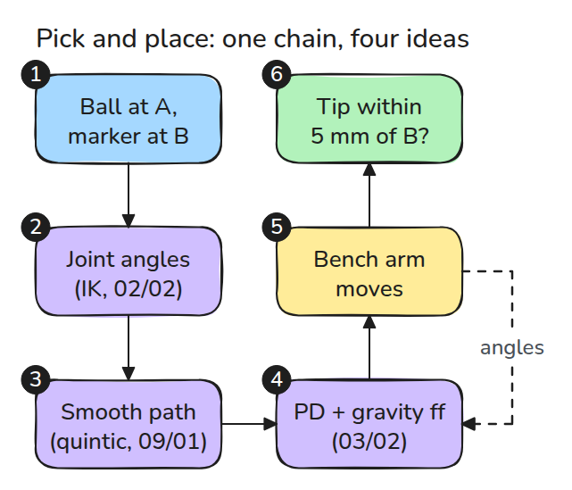
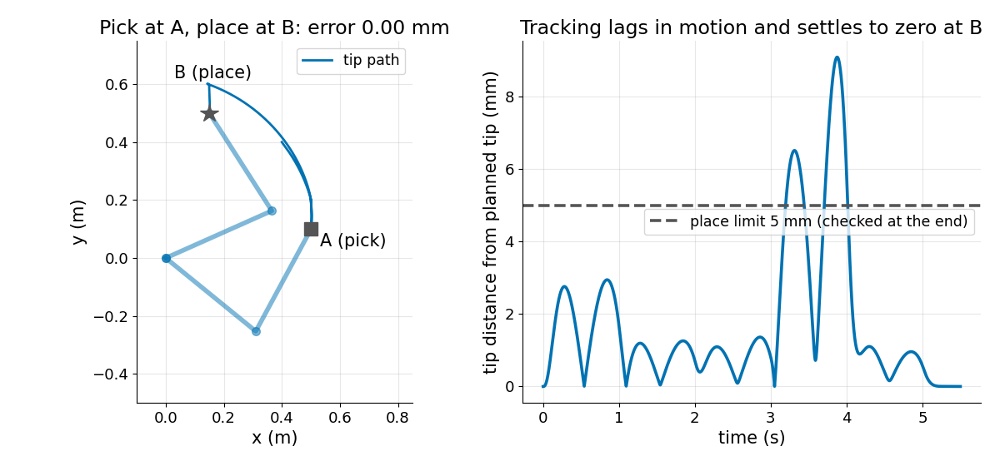
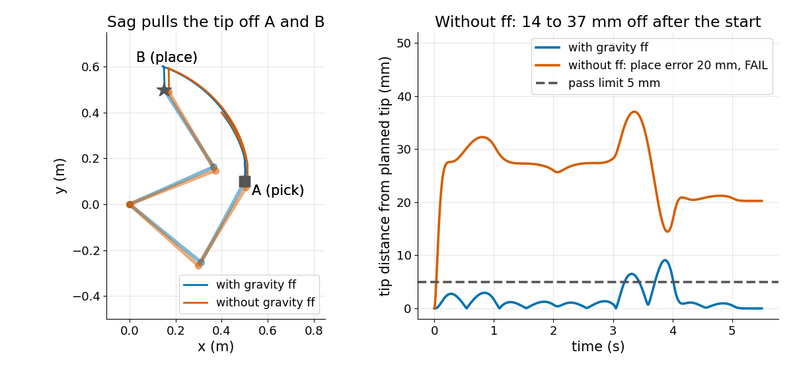

# 시뮬레이션 팔 Pick and Place

> 앞서 배운 네 가지를 합쳐 로봇 팔이 공을 옮기게 하고 하나가 빠지면 무엇이 깨지는지 봅니다.

**유형:** 만들기   **선수 지식:** 02/02 역기구학, 03/02 중력 보상, 09/01 궤적 프로파일   **시간:** 약 30분

## 쉽게 말하면

bench arm이 받침(A) 위의 공을 집어 올려 표시(B) 위에 내려놓아요. 중력이 팔 전체를 아래로 당기기 때문에 팔은 가만히 있기만 해도 위로 받쳐 주는 힘이 계속 필요해요.

gravity feedforward는 그 힘을 미리 더해 줘요. 이것이 없으면 controller는 팔이 처진 뒤에야 되밀어서 팔이 계획보다 낮은 곳에 멈추고 공은 표시 옆에 떨어져요.

## 핵심 용어

- **Inverse kinematics (IK)**: 손이 정한 지점에 닿는 관절 각도를 찾는 일입니다.
- **Quintic**: 처음과 끝에서 멈추는 매끄러운 곡선입니다.
- **PD loop**: 오차에 비례해 밀고 속도에 비례해 브레이크를 거는 제어입니다.
- **Feedforward**: 오차를 기다리지 않고 모델로 미리 더해 주는 힘입니다.
- **Sag**: 중력 때문에 팔이 계획한 자세보다 아래로 꾸준히 처지는 것입니다.
- **Waypoint**: A 위에서 대기하기처럼 경로가 지나가야 하는 자세입니다.

## 문제

팔에게 공을 집어 표시 위에 놓으라고 합니다. 앞의 레슨은 모두 자기 테스트를 통과했는데 공은 2 cm 벗어난 곳에 떨어집니다. 빗나감은 어디서 올까요?

## 개념

실제 로봇 작업은 여러 부품을 이어 붙이므로 작은 부품 하나가 빠져도 작업 전체가 망가질 수 있습니다.



*IK는 각 지점의 관절 각도를 찾고 quintic이 그 지점들을 잇습니다. gravity feedforward를 더한 PD loop가 팔을 그 경로로 움직입니다.*


*feedforward가 없으면 중력 토크 전체가 오차가 되고 position 스프링이 그 오차를 처짐으로 바꿉니다.*

팔을 B에 가만히 세워 두고 계산해 봅시다. 어깨는 6.11 Nm를 버팁니다(`gravity()`). `kp = 150`(오차 1 rad당 150 Nm)이고 feedforward가 없으면 어깨는 `6.11 / 150 = 0.04` rad 정도 내려앉습니다.
0.5 m 떨어진 팁은 약 0.02 m 움직입니다. `run()`이 보고하는 값은 20.24 mm입니다.


*파란 팔은 feedforward 없이 표시에서 20 mm 떨어진 곳에 멈춥니다. 초록 팔은 feedforward를 유지합니다. 처짐은 6배로 그렸습니다.*



*팁은 움직이는 동안 계획보다 최대 9 mm 뒤처지고 B에서는 0.00 mm로 수렴합니다.*



*feedforward가 없으면 팁이 계획에서 14~37 mm 벗어나고 B에서 20 mm 떨어진 곳에 놓아 검사에 실패합니다.*

## 만들기

새로 들어가는 부품은 팔 자체입니다. `M(q) a + C(q, v) + g(q) = tau`(관성과 관절끼리 주고받는 힘과 중력을 나타내는 항들)를 1 ms마다 한 걸음씩 적분합니다.

```python
q, v = step(q, v, ff * gravity(qd) + kp * (qd - q) + kd * (vd - v))
```

`ik()`가 waypoint를 주고 `reference()`가 계획한 각도와 속도 `qd, vd`를 주며 `ff`는 feedforward의 배율입니다. `run()`은 pick 오차와 place 오차, 그리고 `passed`(place 오차 5 mm 미만)를 돌려줍니다.

```bash
cd robotics-engineering-from-scratch
python3 -m pytest phases/16-capstones/01-arm-pick-and-place-sim -q
python3 phases/16-capstones/01-arm-pick-and-place-sim/code/main.py
```

## 실제 도구로 보기

실제 시뮬레이터는 `M`, `C`, `g`를 대신 계산해 줍니다. MuJoCo의 `qfrc_bias`를 이 레슨의 `coriolis + gravity`와 비교해 보세요.

출처: [MuJoCo mjData 레퍼런스](https://mujoco.readthedocs.io/en/stable/APIreference/APItypes.html), 2026년 11월 9일 확인.

## 결과물

`outputs/skill-pick-place-miss-triage.md`는 B에서 빗나간 결과를 원인이 된 단계로 좁혀 줍니다.

## 연습 문제

1. feedforward 배율을 0.9로 두세요. 어떤 `kp`가 여전히 통과하나요?
2. pick 뒤에 link 2에 0.5 kg 블록을 다세요.
3. quintic 경로를 trapezoid로 바꾸세요.
